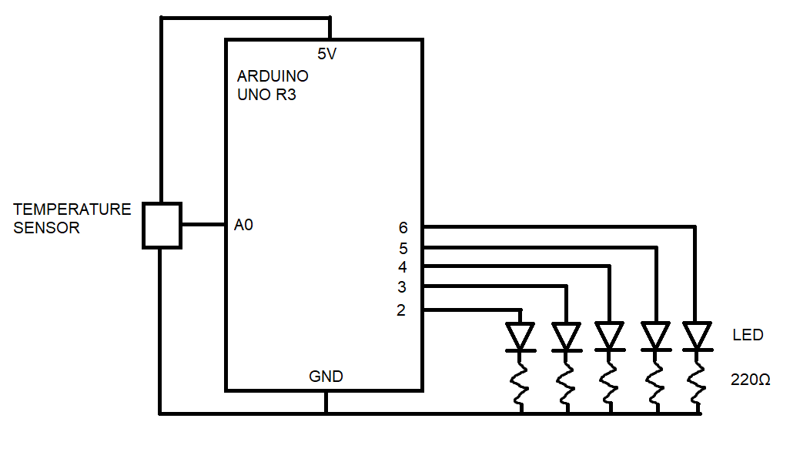
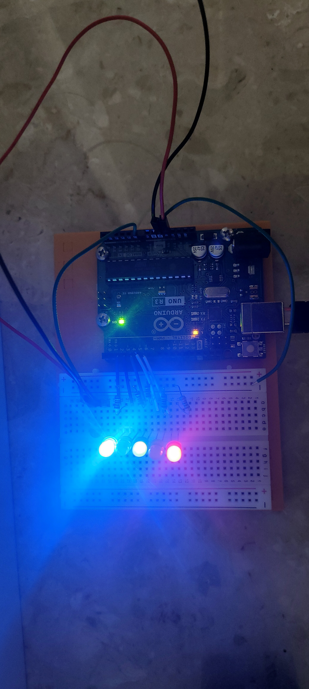
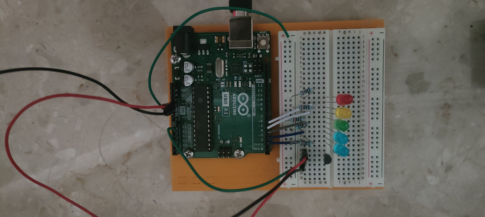
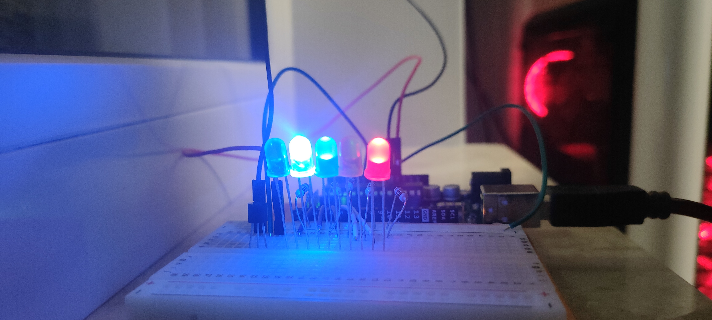

# Thermometer

Simple thermometer created with Arduino UNO R3, and TMP 36 temperature sensor. It shows temperature in binary using 5 LEDs. The highest temperature it can display is 31 Celcius.

- [Reading temperature](#reading-temperature)

- [Schematic View](#schematic-view)

- [Images](#images)

## Reading temperature

LEDs order

We just use binary so

`0*2^0+1*2^1+1*2^2+0*2^3+1*2^4 = 2+4+16 = 22 (DEC)`

In this situation temperature in my room was 22 Celcius

## Schematic View

## Images

